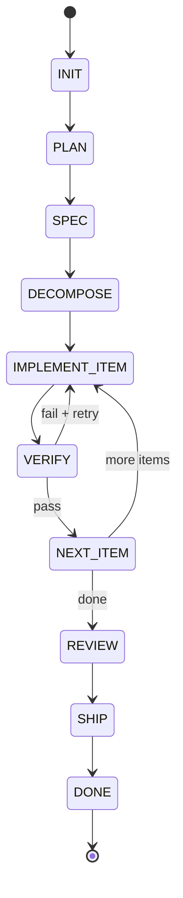

# System Architecture

> **Last Updated:** 2026-01-03  
> **Status:** v0.3 - Self-Improving Orchestrator

## Overview

**orx** is a local, CLI-first orchestrator that coordinates AI coding agents (Codex CLI, Gemini CLI) through a sequential Finite State Machine (FSM). It manages git isolation, quality gates, fix-loops, and produces auditable artifacts.

```
┌─────────────────────────────────────────────────────────────────┐
│                         CLI Layer                                │
│                      (orx run/resume/status)                     │
└─────────────────────────────────────────────────────────────────┘
                                │
                                ▼
┌─────────────────────────────────────────────────────────────────┐
│                       Runner (FSM)                               │
│   INIT → PLAN → SPEC → DECOMPOSE → IMPLEMENT → VERIFY → ...    │
└─────────────────────────────────────────────────────────────────┘
          │              │              │              │
          ▼              ▼              ▼              ▼
    ┌──────────┐  ┌──────────┐  ┌──────────┐  ┌──────────┐
    │ Executor │  │ Context  │  │Workspace │  │  Gates   │
    │ Adapters │  │   Pack   │  │  (Git)   │  │ (Quality)│
    └──────────┘  └──────────┘  └──────────┘  └──────────┘
```

## Core Design Principles

1. **Transparency:** Every action logged, every artifact persisted
2. **Isolation:** Each run uses a separate git worktree
3. **Resumability:** Checkpoint-based state allows crash recovery
4. **Extensibility:** Executors and gates as pluggable adapters

---

## Component Architecture

### 1. CLI Layer

Entry point for all user interactions. Built with Typer.

| Command | Purpose |
|---------|---------|
| `run` | Start new orchestration task |
| `resume` | Continue interrupted run |
| `status` | Show run status |
| `init` | Initialize configuration |
| `clean` | Remove run artifacts |

### 2. Runner (Orchestration FSM)

Central orchestrator implementing a Finite State Machine with these stages:



**Responsibilities:**
- Stage sequencing and dispatch
- Fix-loop orchestration (retry on gate failure)
- State checkpointing for resume
- Meta.json generation (versions, timestamps)

### 3. Executor Adapters

Abstraction layer for CLI agent integration. All executors implement a common protocol.

| Executor | Backend | Mode |
|----------|---------|------|
| Codex | `codex exec --full-auto` | Production |
| Gemini | `gemini --yolo --output-format json` | Production |
| Fake | Deterministic file actions | Testing |

**Operation Modes:**
- `run_text`: Generate text output (plan, spec, review)
- `run_apply`: Modify filesystem (implementation)

**Model routing:** The runner uses `ModelRouter` (`src/orx/executors/router.py`) to select the executor and `ModelSelector` per stage, passing the selector via `StageContext.model_selector` into executor calls.

### 4. Quality Gates

Post-implementation verification layer. Gates run in the worktree after executor changes.

| Gate | Tool | Purpose |
|------|------|---------|
| Ruff | `ruff check` | Linting, formatting |
| Pytest | `pytest` | Test execution |
| Docker | `docker build` | Container build (optional) |
| **Generic** | **Custom command** | **Arbitrary checks (helm-lint, e2e-tests, etc.)** |

**New in v0.2:** Generic gates allow running any custom command as a quality check, enabling project-specific validation workflows.

Gate failures trigger the fix-loop with evidence passed to the executor.

### 5. Workspace Management

Git-based isolation using worktrees.

```
.worktrees/<run_id>/     # Isolated git worktree
    └── (full repo copy)

runs/<run_id>/
    ├── artifacts/
    │   └── patch.diff   # Always produced by `git diff`
    └── ...
```

**Guardrails:** Prevent modification of sensitive files (`.env`, secrets, `.git/`).

### 6. Context Pack

Artifact management layer. Handles read/write of all context files.

```
runs/<run_id>/context/
    ├── task.md              # Input task
    ├── plan.md              # Generated plan
    ├── spec.md              # Technical specification
    ├── backlog.yaml         # Work items (Pydantic-validated)
    ├── project_map.md       # Project structure (stack-only profile)
    ├── tooling_snapshot.md  # Full tooling context
    ├── verify_commands.md   # Gate verification commands
    ├── decisions.md         # Design decisions
    └── lessons.md           # Lessons learned
```

### 7. State Management

JSON-based persistence enabling resume from any checkpoint.

```json
{
  "run_id": "20260102_120000_abc12345",
  "current_stage": "implement_item",
  "current_item_id": "W002",
  "current_iteration": 1,
  "baseline_sha": "abc123...",
  "stage_statuses": { ... }
}
```

### 8. Prompt Templates

Jinja2-based template system for consistent agent prompts.

```
src/orx/prompts/templates/
    ├── plan.md
    ├── spec.md
    ├── decompose.md
    ├── implement.md
    ├── fix.md
    └── review.md
```

---

## Data Flow

### Normal Execution Flow

```
User Task (string or @file.md)
         │
         ▼
    ┌─────────┐
    │  PLAN   │──► Executor (text mode) ──► plan.md
    └─────────┘
         │
         ▼
    ┌─────────┐
    │  SPEC   │──► Executor (text mode) ──► spec.md
    └─────────┘
         │
         ▼
    ┌─────────┐
    │DECOMPOSE│──► Executor (text mode) ──► backlog.yaml
    └─────────┘
         │
         ▼
    ┌─────────────────────────────────────┐
    │  IMPLEMENT LOOP (per work item)     │
    │  ┌──────────┐    ┌────────┐         │
    │  │IMPLEMENT │───►│ VERIFY │         │
    │  └──────────┘    └────────┘         │
    │       ▲              │              │
    │       │   fail       │ pass         │
    │       └──────────────┘              │
    └─────────────────────────────────────┘
         │
         ▼
    ┌─────────┐
    │ REVIEW  │──► Executor (text mode) ──► review.md, pr_body.md
    └─────────┘
         │
         ▼
    ┌─────────┐
    │  SHIP   │──► git commit/push ──► (optional) gh pr create
    └─────────┘
```

### Fix-Loop Data Flow

```
Gate Failure (ruff/pytest)
         │
         ▼
    ┌────────────────────┐
    │ Evidence Bundle    │
    │ - ruff.log tail    │
    │ - pytest.log tail  │
    │ - patch.diff       │
    │ - "diff_empty" flag│
    └────────────────────┘
         │
         ▼
    ┌────────────────────┐
    │ Fix Prompt         │
    │ (includes evidence)│
    └────────────────────┘
         │
         ▼
    Executor (apply mode)
         │
         ▼
    Re-run Gates
```

---

## Technology Stack

| Layer | Technology |
|-------|------------|
| Language | Python 3.11+ |
| CLI Framework | Typer |
| Configuration | Pydantic + YAML |
| Templating | Jinja2 |
| Logging | structlog (JSON) |
| Version Control | Git (worktrees) |
| Linting | Ruff |
| Testing | Pytest |
| Type Checking | mypy (strict) |

---

## Module Dependency Graph

```
cli.py ──────────────────────────────┐
                                     │
                                     ▼
                               runner.py
                                     │
         ┌───────────────────────────┼───────────────────────────┐
         │                           │                           │
         ▼                           ▼                           ▼
    stages/*                    state.py                   config.py
         │                           │
         │                           ▼
         │                       paths.py
         │                           │
         ▼                           ▼
    ┌─────────┐               ┌─────────────┐               ┌─────────┐
    │executors│               │  context/   │               │metrics/ │
    │  gates  │               │  workspace/ │               │         │
    └─────────┘               └─────────────┘               └─────────┘
         │                           │                           │
         └───────────┬───────────────┴───────────────────────────┘
                     ▼
               infra/command.py
                     │
                     ▼
              subprocess (OS)
```

**Enforced Rules:**
- No cyclic imports
- All subprocess calls via `CommandRunner`
- All file writes via `ContextPack` or `RunPaths`
- Metrics collection via `MetricsCollector`

---

## Run Artifact Structure

```
runs/<run_id>/
    ├── meta.json           # Versions, timestamps, summary
    ├── state.json          # FSM state (for resume)
    │
    ├── context/
    │   ├── task.md
    │   ├── plan.md
    │   ├── spec.md
    │   ├── backlog.yaml
    │   ├── project_map.md      # Stack-only context profile
    │   ├── tooling_snapshot.md # Full tooling context
    │   ├── verify_commands.md  # Gate verification commands
    │   ├── decisions.md
    │   └── lessons.md
    │
    ├── prompts/            # Materialized prompts
    │   ├── plan.md
    │   ├── spec.md
    │   └── ...
    │
    ├── artifacts/
    │   ├── patch.diff      # From `git diff` (never agent-produced)
    │   ├── review.md
    │   └── pr_body.md
    │
    ├── metrics/            # Stage and run metrics
    │   ├── stages.jsonl    # Per-stage attempt records
    │   └── run.json        # Aggregated run summary
    │
    └── logs/
        ├── agent_plan.stdout.log
        ├── agent_plan.stderr.log
        ├── agent_impl_item_W001_iter_1.stdout.log
        ├── ruff.log
        ├── pytest.log
        └── ...
```

---

## Recent Enhancements (v0.2)

### 1. Generic Gates
Custom command-based gates for project-specific validation workflows. Configure any shell command as a quality check:

```yaml
gates:
  - name: helm-lint
    command: make
    args: ["helm-lint"]
    required: true
```

### 2. Artifact Filtering
Prevents temporary files (e.g., `pr_body.md`, `review.md`) from polluting the worktree diff. Artifacts are excluded automatically using git pathspec exclusions.

### 3. Guardrail Allowlist Mode
Strict scope control for limiting agent modifications to specific file patterns:

```yaml
guardrails:
  mode: allowlist
  allowed_patterns:
    - "src/**/*.py"
    - "tests/**/*.py"
```

When enabled, only files matching `allowed_patterns` can be modified, preventing agents from touching documentation, configs, or other sensitive files.

### 4. Timeout Observability
- **Stage-specific timeouts**: Override default timeout for long-running stages
- **Heartbeat logging**: Periodic progress updates for commands exceeding 30s
- **Follow mode**: `orx status --follow` for live run monitoring

```yaml
engine:
  timeout: 600  # Default 10 minutes
  stage_timeouts:
    implement: 1800  # 30 minutes for implementation
```

### 5. Per-Stage Executor / Model Routing
Configure different executors and models per stage while keeping a primary engine:

```yaml
engine:
  type: codex
  model: gpt-4.1  # legacy default (lowest priority)

executors:
  codex:
    bin: codex
    default:
      model: gpt-5.2
      reasoning_effort: high
    profiles:
      review: deep-review
  gemini:
    bin: gemini
    default:
      model: gemini-2.5-flash
      output_format: json

stages:
  plan:
    executor: gemini
    model: gemini-2.5-pro
  implement:
    executor: codex
    model: gpt-5.2
    reasoning_effort: high
```

Model selection priority: `stages.<stage>` → `executors.<name>.profiles[stage]` (Codex) → `executors.<name>.default.*` → `engine.*` → CLI default.

Stage keys: `plan`, `spec`, `decompose`, `implement`, `fix`, `review`, `knowledge_update`.

### 6. Base Branch Validation
Validates that worktree baseline SHA matches the expected base branch. Logs warnings on mismatch to catch configuration discrepancies early.

### 7. Repo Context Pack (v0.6)

Automatic injection of high-signal, compact repository context into prompts. Reduces lint/verify errors by providing agents with stack and tooling configuration upfront.

```
┌─────────────────────────────────────────────────────────────────┐
│                    Repo Context Pack Flow                        │
│                                                                  │
│  Worktree Created → RepoContextBuilder.build()                  │
│                           │                                      │
│         ┌─────────────────┼─────────────────┐                   │
│         ▼                 ▼                 ▼                   │
│  ┌──────────────┐  ┌──────────────┐  ┌──────────────┐          │
│  │   Python     │  │  TypeScript  │  │    Gates     │          │
│  │  Extractor   │  │  Extractor   │  │  Commands    │          │
│  └──────────────┘  └──────────────┘  └──────────────┘          │
│         │                 │                 │                   │
│         └─────────────────┼─────────────────┘                   │
│                           ▼                                      │
│                    ContextPacker                                 │
│                  (priority + budget)                            │
│                           │                                      │
│         ┌─────────────────┼─────────────────┐                   │
│         ▼                 ▼                 ▼                   │
│  project_map.md    tooling_snapshot.md   verify_commands.md    │
│  (stack-only)      (full context)        (gate commands)        │
└─────────────────────────────────────────────────────────────────┘
```

**Module Structure:**
```
src/orx/context/repo_context/
├── __init__.py          # Package exports
├── blocks.py            # ContextBlock dataclass, priority enum
├── packer.py            # Budget-aware context packing
├── python_extractor.py  # pyproject.toml, ruff, mypy, pytest
├── ts_extractor.py      # package.json, tsconfig, eslint, prettier
├── verify_commands.py   # Build verify commands from gates
└── builder.py           # RepoContextBuilder coordinator
```

**Context Profiles:**

| Stage | Profile | Budget | Content |
|-------|---------|--------|---------|
| plan, spec | stack-only | ~3000 chars | Stack name + basics |
| implement, fix | full | ~11000 chars | Full tooling config |

**Priority System:**

| Priority | Value | Content |
|----------|-------|---------|
| VERIFY_COMMANDS | 100 | Gate commands (always included) |
| PYTHON_CORE | 80 | pyproject.toml [project], ruff, mypy |
| TS_CORE | 75 | package.json, tsconfig |
| LAYOUT | 50 | Project structure |
| FORMATTER | 30 | prettier, eslint |
| EXTRAS | 10 | Additional config |

**Extractors:**
- **PythonExtractor**: Reads pyproject.toml (project deps, ruff, mypy, pytest)
- **TypeScriptExtractor**: Reads package.json, tsconfig.json, eslint config, prettierrc

**Integration:**
- Context built once after workspace creation
- Artifacts persisted for resume (deterministic)
- Prompt templates conditionally include `...`

### 8. Self-Improvement (Knowledge Update Stage)
Automatic updates to AGENTS.md and ARCHITECTURE.md after successful task completion.

```
┌─────────────────────────────────────────────────────────────────┐
│                    Knowledge Update Flow                         │
│                                                                  │
│  VERIFY (success) → SHIP → KNOWLEDGE_UPDATE → DONE              │
│                              │                                   │
│                    ┌─────────┴─────────┐                        │
│                    ▼                   ▼                        │
│            ┌──────────────┐    ┌──────────────┐                │
│            │ AGENTS.md    │    │ARCHITECTURE  │                │
│            │ (always)     │    │(gatekeeping) │                │
│            └──────────────┘    └──────────────┘                │
└─────────────────────────────────────────────────────────────────┘
```

**Key Features:**
- **Marker-scoped updates**: Only content within `<!-- ORX:START/END -->` markers is modified
- **Architecture gatekeeping**: Only updates ARCHITECTURE.md if changes affect structure
- **Guardrails**: Max lines changed, deletion limits, allowlist files
- **Non-fatal**: Failures don't break the run

### 9. Metrics & Monitoring (v0.4)

Comprehensive observability for data-driven improvements. Tracks stage-level and run-level metrics.

```
┌─────────────────────────────────────────────────────────────────┐
│                    Metrics Data Flow                             │
│                                                                  │
│  Stage Start ──► MetricsCollector ──► StageTimer                │
│       │                │                  │                      │
│       │                ▼                  ▼                      │
│       │         Record: model,      LLM timing,                 │
│       │         gates, quality      verify timing               │
│       │                │                  │                      │
│  Stage End ◄───────────┴──────────────────┘                     │
│       │                                                          │
│       ▼                                                          │
│  MetricsWriter ──► stages.jsonl (append)                        │
│       │                                                          │
│  Run End                                                         │
│       │                                                          │
│       ▼                                                          │
│  MetricsWriter ──► run.json (aggregate)                         │
│       │          ──► index.jsonl (global)                       │
└─────────────────────────────────────────────────────────────────┘
```

**Metrics Collected:**

| Metric Type | Data Captured |
|-------------|---------------|
| **Stage** | Duration (total, LLM, verify), attempt #, status, failure category |
| **Gate** | Name, passed, duration, error count, test counts |
| **Quality** | Spec score, plan score, diff hygiene, pack relevance |
| **Run** | Total duration, stage breakdown, fix attempts, gate pass/fail |

**File Structure:**
```
runs/<run_id>/metrics/
    ├── stages.jsonl    # One line per stage attempt (JSONL)
    └── run.json        # Aggregated run summary (JSON)

~/.orx/metrics/
    └── aggregate.json  # Cross-run analysis
```

**CLI Commands:**
```bash
orx metrics rebuild              # Rebuild aggregate from all runs
orx metrics report               # Human-readable summary
orx metrics report --json        # JSON output
orx metrics show <run_id>        # Run-level metrics
orx metrics show <run_id> -s     # Per-stage metrics
```

**Quality Analysis:**
- `analyze_spec_quality()`: Scores spec by AC, file hints, schema
- `analyze_plan_quality()`: Scores plan by overview, steps, risks
- `analyze_diff_hygiene()`: Checks file count and LOC against limits
- `analyze_pack_relevance()`: Ratio of pack files actually modified


---

## Dashboard Module (v0.5)

Local web UI for monitoring and controlling orx runs. Built with FastAPI + HTMX for a server-rendered, low-JavaScript architecture.

### Architecture Overview

```
┌─────────────────────────────────────────────────────────────────┐
│                     Dashboard Architecture                       │
│                                                                  │
│   Browser ──HTMX──► FastAPI ──► Store ──► FileSystem (runs/)    │
│      │                │                                          │
│      │                ├──► Worker ──► subprocess (orx run)      │
│      │                │                                              │
└─────────────────────────────────────────────────────────────────┘
```

### Key Design Decisions

| Decision | Choice | Rationale |
|----------|--------|-----------|
| Frontend | HTMX + Jinja2 | No │                     Dashboard Architecture                       │
│                                                         e-user local tool |
| Binding | 127.0.0.1 only | Security - local use only |

### Module Structure

```
src/orx/dashboard/
├── __init__.py          # Package exports (create_app, DashboardConfig)
├── __main__.py          # Entry point for python -m orx.dashboard
├── config.py            with env var support
├── server.py            # FastAPI app factory
│
├── store/               # Data access layer
│   ├── models.py        # Pydantic models (RunSummary, RunDetail, etc.)
│   ├── base.py          # Protocol definitions
│   └── filesystem.py    # FileSystemRunStore implementation
│
├── handlers/            # Route handlers
│   ├── pages.py         # Full page routes (/, /runs/{id})
│   ├── partials.ol API (start/cancel)
│
├── worker/              # Background processing
│   └── local.py         # LocalWorker with subprocess management
│
├── templates/           # Jinja2 templates
│   ├── base.html
│   ├── pages/           # Full page templates
│   └── partials/        # HTMX partial templates
│
└── static/              # Static assets
    ├── htmx.min.js
    └── style.css
```

### Data Models

```python
# Key models from store/models.py

class RunStatus(StrEnum):
    PENDING = "p│
├── store/               # Data access lass RunSummary:
    run_id: str
    task: str
    status: │   ├── base.py          # Protocol definitions
│   └── filesys_s?e: str | None

class RunDetail(RunSummary):
    completed_stages: list[str]
    fix_loop_count: int
    last_error: LastError | None
    artifacts: list[ArtifactInfo]
```

### Security Measures

1. **Localhost binding**: Dashboard only binds to 127.0.0.1
2. **Path safety**: Artifact access uses allowlist extensions (.md, .json, .log, .diff, .txt, .yaml)
3. **Path traversal prevention**: No ".." allowed in artifact paths
4. **Run ID validation**: Run IDs must be valid directory names

### Endpoints

| Route | Method | Purpose |
|-------|--------|---------|
|  | GET | Runs list page |
|  | GET | Run detail page |
|  | GET | Active runs table (HTMX) |
|  | GET | Recent runs table (HTMX) |
|  | GET | Run status header (HTMX) |
|  | GET | Tab content (HTMX) |
|  | GET | Artifact preview (HTMX) |
|  | GET | Diff view (HTMX) |
|  | GET | Log tail with cursor (HTMX) |
|  | POST | Start new run |
|  | POST | Cancel running run |
|  | GET | Get run status (JSON) |
|  | GET | Health check |

### Usage

```bash
# Install dashboard dependencies
pip install -e ".[dashboard]"

# Run the dashboard
python -m orx.dashboard

# With options
python -m orx.dashboard --host 0.0.0.0 --port 8080 --runs-root ./runs

# Environment variables
ORX_RUNS_ROOT=./runs
ORX_DASHBOARD_HOST=127.0.0.1
ORX_DASHBOARD_PORT=8421
```

---

## Extension Points

### Adding a New Executor

1. Create `src/orx/executors/myengine.py`
2. Implement `Executor` protocol (run_text, run_apply)
3. Add to `EngineType` enum in `config.py`
4. Register in `runner.py:_create_executor()`

### Adding a New Gate

1. Create `src/orx/gates/mygate.py`
2. Implement `Gate` protocol (run method)
3. Add to gate config in `config.py`
4. Register in `runner.py:_create_gates()`

### Adding a New Stage

1. Create `src/orx/stages/mystage.py`
2. Extend `BaseStage`, `TextOutputStage`, or `ApplyStage`
3. Create template in `prompts/templates/mystage.md`
4. Add to `runner.py` stage dict and FSM order

<!-- ORX:START ARCH -->
## Auto-Updated Architectural Notes

### Knowledge Module (v0.3)
New module `src/orx/knowledge/` implements self-improvement capabilities:
- **EvidenceCollector**: Gathers run artifacts for knowledge extraction
- **KnowledgeGuardrails**: Enforces marker scoping and change limits
- **KnowledgeUpdater**: Coordinates AGENTS.md and ARCHITECTURE.md updates

Stage order: `... → SHIP → KNOWLEDGE_UPDATE → DONE`
<!-- ORX:END ARCH -->
