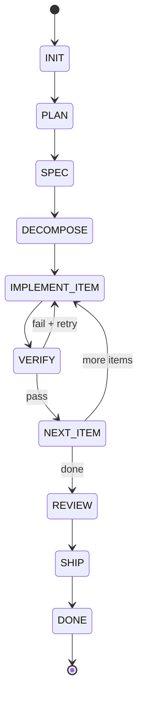

# System Architecture

> **Last Updated:** 2026-02-16  
> **Status:** v0.5 - Pipeline Engine + Code Intelligence

## Overview

**orx** is a local, CLI-first orchestrator that coordinates AI coding agents (Codex CLI, Gemini CLI, Claude Code, Copilot, Cursor) through a pipeline engine (`pipeline/*`, `standard` by default). A legacy FSM flow remains available via `orx run --legacy-fsm`. It manages git isolation, quality gates, fix-loops, context caching, code intelligence, and produces auditable artifacts.

```
┌─────────────────────────────────────────────────────────────────┐
│                         CLI Layer                                │
│            (orx run/resume/status/pipelines/observability)        │
└─────────────────────────────────────────────────────────────────┘
                                │
                                ▼
┌─────────────────────────────────────────────────────────────────┐
│              Runner (Pipeline Engine + Legacy FSM)              │
│   standard/fast_fix/plan_only pipelines + legacy FSM fallback   │
└─────────────────────────────────────────────────────────────────┘
     │          │          │          │          │          │
     ▼          ▼          ▼          ▼          ▼          ▼
┌────────┐┌────────┐┌────────┐┌────────┐┌────────────┐┌─────────┐
│Executor││Context ││Work-   ││ Gates  ││Observ-     ││Intelli- │
│Adapters││  Pack  ││space   ││(Qual.) ││ability v2  ││gence    │
└────────┘└────────┘└────────┘└────────┘└────────────┘└─────────┘
```

## Core Design Principles

1. **Transparency:** Every action logged, every artifact persisted
2. **Isolation:** Each run uses a separate git worktree
3. **Resumability:** Checkpoint-based state allows crash recovery
4. **Extensibility:** Executors and gates as pluggable adapters

---

## Component Architecture

### 1. CLI Layer

Entry point for all user interactions. Built with Typer.

| Command | Purpose |
|---------|---------|
| `run` | Start new orchestration task |
| `resume` | Continue interrupted/paused run |
| `status` | Show run status (`--follow`, `--json`) |
| `init` | Initialize configuration |
| `clean` | Remove run artifacts |
| `pipelines list/show/create/delete` | Manage pipeline definitions |
| `observability validate/export` | Validate and export run events |

### 2. Runner (Orchestration Engine)

Production path uses `PipelineRunner` with built-in and custom pipelines. Legacy FSM is retained for migration/debug via `--legacy-fsm`.

**Pipeline Engine (default):**

Declarative, node-based execution with typed nodes:

| Node Type | Purpose | Example |
|-----------|---------|--------|
| `LLM_TEXT` | Generate text output | plan, spec, review |
| `LLM_APPLY` | Modify filesystem | implement, fix |
| `MAP` | Iterate over backlog items | implement loop |
| `GATE` | Run quality checks | verify |
| `CUSTOM` | Custom callable | reproduce verification |

Built-in pipelines:
- **`standard`**: Plan → Spec → Decompose → Implement (MAP with verify) → Review → Ship
- **`fast_fix`**: Implement → Verify → Review → Ship (skip planning)
- **`plan_only`**: Plan only

**Pause/Resume (interactive nodes):**
Nodes with `interactive: true` trigger pause after completion. `orx resume <run_id>` continues from the next node. State tracks `paused_after_node` and `paused_pipeline_id`.

Legacy FSM stages:


```mermaid
stateDiagram-v2
    [*] --> INIT
    INIT --> PLAN
    PLAN --> SPEC
    SPEC --> DECOMPOSE
    DECOMPOSE --> IMPLEMENT_ITEM
    IMPLEMENT_ITEM --> VERIFY
    VERIFY --> IMPLEMENT_ITEM: fail + retry
    VERIFY --> NEXT_ITEM: pass
    NEXT_ITEM --> IMPLEMENT_ITEM: more items
    NEXT_ITEM --> REVIEW: done
    REVIEW --> SHIP
    SHIP --> DONE
    DONE --> [*]
```

**Responsibilities:**
- Stage sequencing and dispatch
- Fix-loop orchestration (retry on gate failure)
- Review loop (up to 3 iterations with feedback)
- Reproduce verification (Fail-to-Pass pattern)
- State checkpointing for resume (including PAUSED state)
- Meta.json generation (versions, timestamps)
- Intelligence context building (tree-sitter graph + SmartBundler)

### 3. Executor Adapters

Abstraction layer for CLI agent integration. All executors extend `BaseExecutor` base class.

| Executor | Backend | Mode |
|----------|---------|------|
| Codex | `codex exec --full-auto` | Production |
| Gemini | `gemini --yolo --output-format json` | Production |
| Claude Code | `claude -p --output-format json` | Production (NEW) |
| Copilot | `copilot --prompt @<file>` | Production (NEW) |
| Cursor | `agent -p --output-format json` | Production (NEW) |
| Fake | Deterministic file actions | Testing |

**Operation Modes:**
- `run_text`: Generate text output (plan, spec, review)
- `run_apply`: Modify filesystem (implementation)

**Model routing:** The runner uses `ModelRouter` (`src/orx/executors/router.py`) to select the executor and `ModelSelector` per stage, passing the selector via `StageContext.model_selector` into executor calls.

**Centralized model registry:** `src/orx/executors/models.py` defines all available models with capabilities (context window, reasoning, tool use). Supports dynamic discovery.

**Context caching:** Static context (AGENTS.md, ARCHITECTURE.md, repo context) is split into a companion `<stage>_system.md` file. Claude Code passes it via `--system-prompt` for Anthropic prompt caching; other executors prepend for provider-side prefix caching.

### 4. Quality Gates

Post-implementation verification layer. Gates run in the worktree after executor changes.

| Gate | Tool | Purpose |
|------|------|---------|
| Ruff | `ruff check` | Linting, formatting |
| Pytest | `pytest` | Test execution |
| Docker | `docker build` | Container build (optional) |
| **Generic** | **Custom command** | **Arbitrary checks (helm-lint, e2e-tests, etc.)** |

**New in v0.2:** Generic gates allow running any custom command as a quality check, enabling project-specific validation workflows.

Gate failures trigger the fix-loop with evidence passed to the executor.

### 5. Workspace Management

Git-based isolation using worktrees.

```
.worktrees/<run_id>/     # Isolated git worktree
    └── (full repo copy)

runs/<run_id>/
    ├── artifacts/
    │   └── patch.diff   # Always produced by `git diff`
    └── ...
```

**Guardrails:** Prevent modification of sensitive files (`.env`, secrets, `.git/`).

### 6. Context Pack

Artifact management layer. Handles read/write of all context files.

```
runs/<run_id>/context/
    ├── task.md              # Input task
    ├── plan.md              # Generated plan
    ├── spec.md              # Technical specification
    ├── backlog.yaml         # Work items (Pydantic-validated)
    ├── project_map.md       # Project structure (stack-only profile)
    ├── tooling_snapshot.md  # Full tooling context
    ├── verify_commands.md   # Gate verification commands
    ├── decisions.md         # Design decisions
    └── lessons.md           # Lessons learned
```

### 7. State Management

JSON-based persistence enabling resume from any checkpoint.

```json
{
  "run_id": "20260102_120000_abc12345",
  "current_stage": "implement_item",
  "current_item_id": "W002",
  "current_iteration": 1,
  "baseline_sha": "abc123...",
  "stage_statuses": { ... }
}
```

### 8. Prompt Templates

Jinja2-based template system for consistent agent prompts.

```
src/orx/prompts/templates/
    ├── plan.md
    ├── spec.md
    ├── decompose.md
    ├── decompose_fix.md
    ├── implement.md
    ├── implement_direct.md
    ├── implement_smoke.md
    ├── fix.md
    ├── reproduce.md
    ├── review.md
    ├── review_smoke.md
    ├── knowledge_agents.md
    ├── knowledge_arch.md
    ├── system_context.md       # Context caching: static context split
    └── exploration_tools.md    # Power tool usage guide for agents
```

**Context caching flow:** `renderer.py` produces both `<stage>.md` (user prompt) and `<stage>_system.md` (cached system context) via the `system_context.md` template.

### 9. Code Intelligence (Tree-sitter)

Optional smart context assembly using tree-sitter for AST-level understanding.

```
src/orx/context/intelligence/
├── parser.py     # RepoParser: extract definitions, imports (Python/JS/TS/TSX)
├── skeleton.py   # SkeletonGenerator: strip bodies, keep signatures + docstrings
├── graph.py      # RepoGraph: file-level dependency graph + compact repo map
└── bundle.py     # SmartBundler: tiered context assembly
```

**Tiered context strategy:**

| Tier | Content | Budget |
|------|---------|--------|
| 1 | Full source of focus files | ~50K chars |
| 2 | Skeletons of 1st-level neighbours | ~30K chars |
| 3 | Repo map of remaining files | ~15K chars |

`SmartBundler` produces a `BundleResult` with `repo_map` and `smart_context`. The `PipelineRunner` feeds this into `ContextBuilder` which assembles per-node context (including `repo_tags` and `smart_context` variables).

Gracefully degrades if `tree_sitter` is not installed.

### 10. Observability v2

Event-first tracing system — the canonical observability source.

```
src/orx/observability/
├── schema.py       # ObsEvent, Correlation, SCHEMA_VERSION="2.0"
├── correlation.py  # StepCounter (monotonic, persistent), CorrelationIds
├── writer.py       # EventWriter (JSONL) + MetadataWriter (JSON)
├── runtime.py      # RunObservability: session lifecycle, all event emission
├── tty.py          # TTYRecorder: asciinema v2 cast files
├── projector.py    # ProjectedRun: derive summaries from raw events
├── redaction.py    # Recursive sensitive field redaction
└── validate.py     # Event file validation (schema, monotonic step_ids)
```

**Event types:** `run.start/end`, `stage.start/end`, `llm.request/response`, `proc.exec.start/end`, `fs.patch`, `gate.approval`, `tty.segment.start/end`, `network.request/response`, `network.capture.config`, `observability.warning`

**Integration with CommandRunner:** `RunObservability.make_command_observer()` hooks into `CommandRunner` via the `CommandObserver` protocol to emit `proc.exec.*` events automatically.

**Validation/export:**
```bash
orx observability validate --run-id <id>
orx observability export --run-id <id> --mode redacted
```

---

## Data Flow

### Normal Execution Flow

```
User Task (string or @file.md)
         │
         ▼
    ┌─────────┐
    │  PLAN   │──► Executor (text mode) ──► plan.md
    └─────────┘
         │
         ▼
    ┌─────────┐
    │  SPEC   │──► Executor (text mode) ──► spec.md
    └─────────┘
         │
         ▼
    ┌─────────┐
    │DECOMPOSE│──► Executor (text mode) ──► backlog.yaml
    └─────────┘
         │
         ▼
    ┌─────────────────────────────────────┐
    │  IMPLEMENT LOOP (per work item)     │
    │  ┌──────────┐    ┌────────┐         │
    │  │IMPLEMENT │───►│ VERIFY │         │
    │  └──────────┘    └────────┘         │
    │       ▲              │              │
    │       │   fail       │ pass         │
    │       └──────────────┘              │
    └─────────────────────────────────────┘
         │
         ▼
    ┌─────────┐
    │ REVIEW  │──► Executor (text mode) ──► review.md, pr_body.md
    └─────────┘
         │
         ▼
    ┌─────────┐
    │  SHIP   │──► git commit/push ──► (optional) gh pr create
    └─────────┘
```

### Fix-Loop Data Flow

```
Gate Failure (ruff/pytest)
         │
         ▼
    ┌────────────────────┐
    │ Evidence Bundle    │
    │ - ruff.log tail    │
    │ - pytest.log tail  │
    │ - patch.diff       │
    │ - "diff_empty" flag│
    └────────────────────┘
         │
         ▼
    ┌────────────────────┐
    │ Fix Prompt         │
    │ (includes evidence)│
    └────────────────────┘
         │
         ▼
    Executor (apply mode)
         │
         ▼
    Re-run Gates
```

---

## Technology Stack

| Layer | Technology |
|-------|------------|
| Language | Python 3.11, 3.12 |
| CLI Framework | Typer |
| Configuration | Pydantic + YAML |
| Templating | Jinja2 |
| Logging | structlog (JSON) |
| Version Control | Git (worktrees) |
| Linting | Ruff |
| Testing | Pytest |
| Type Checking | mypy (strict) |
| Token Counting | tiktoken (with fallback) |
| Code Intelligence | tree-sitter (optional) |
| Dashboard | FastAPI + HTMX + Prism.js |

---

## Module Dependency Graph

```
cli.py ──────────────────────────────┐
                                     │
                                     ▼
                               runner.py
                                     │
         ┌───────────────────────────┼───────────────────────────┐
         │                           │                           │
         ▼                           ▼                           ▼
    stages/*                    state.py                   config.py
    pipeline/*                       │
         │                           ▼
         │                       paths.py
         │                           │
         ▼                           ▼
    ┌─────────┐               ┌─────────────┐               ┌───────────────┐
    │executors│               │  context/   │               │observability/ │
    │  gates  │               │  workspace/ │               │               │
    └─────────┘               │ intelligence│               └───────────────┘
         │                    └─────────────┘                     │
         └───────────┬───────────────┴───────────────────────────┘
                     ▼
               infra/command.py
                     │
                     ▼
              subprocess (OS)
```

**Enforced Rules:**
- No cyclic imports
- All subprocess calls via `CommandRunner`
- All file writes via `ContextPack` or `RunPaths`
- Observability event capture via `src/orx/observability/*`

---

## Run Artifact Structure

```
runs/<run_id>/
    ├── meta.json           # Versions, timestamps, summary
    ├── state.json          # FSM/pipeline state (for resume, incl. PAUSED)
    │
    ├── context/
    │   ├── task.md
    │   ├── plan.md
    │   ├── spec.md
    │   ├── backlog.yaml
    │   ├── project_map.md      # Stack-only context profile
    │   ├── tooling_snapshot.md # Full tooling context
    │   ├── verify_commands.md  # Gate verification commands
    │   ├── repo_tags.md        # Tree-sitter repo map (NEW)
    │   ├── smart_context.md    # Tiered intelligence context (NEW)
    │   ├── reproduce_failure.md # Reproduction failure output (NEW)
    │   ├── decisions.md
    │   └── lessons.md
    │
    ├── prompts/            # Materialized prompts
    │   ├── plan.md
    │   ├── plan_system.md  # Context caching companion (NEW)
    │   ├── spec.md
    │   └── ...
    │
    ├── artifacts/
    │   ├── patch.diff      # From `git diff` (never agent-produced)
    │   ├── review.md
    │   └── pr_body.md
    │
    ├── observability/      # Canonical v2 observability bundle
    │   ├── events.jsonl    # Event envelope timeline
    │   ├── metadata.json
    │   ├── tty/
    │   │   └── session.cast
    │   ├── llm/
    │   │   ├── request_<call_id>.txt
    │   │   └── response_<call_id>.txt
    │   ├── patches/
    │   │   └── *.diff
    │   └── exports/
    │       └── redacted/
    │           └── events.redacted.jsonl
    │
    ├── metrics/            # Legacy v1 metrics (kept for compatibility)
    │   ├── stages.jsonl
    │   └── run.json
    │
    └── logs/
        ├── agent_plan.stdout.log
        ├── agent_plan.stderr.log
        ├── agent_impl_item_W001_iter_1.stdout.log
        ├── ruff.log
        ├── pytest.log
        └── ...
```
```

---

## Recent Enhancements (v0.2)

### 1. Generic Gates
Custom command-based gates for project-specific validation workflows. Configure any shell command as a quality check:

```yaml
gates:
  - name: helm-lint
    command: make
    args: ["helm-lint"]
    required: true
```

### 2. Artifact Filtering
Prevents temporary files (e.g., `pr_body.md`, `review.md`) from polluting the worktree diff. Artifacts are excluded automatically using git pathspec exclusions.

### 3. Guardrail Allowlist Mode
Strict scope control for limiting agent modifications to specific file patterns:

```yaml
guardrails:
  mode: allowlist
  allowed_patterns:
    - "src/**/*.py"
    - "tests/**/*.py"
```

When enabled, only files matching `allowed_patterns` can be modified, preventing agents from touching documentation, configs, or other sensitive files.

### 4. Timeout Observability
- **Stage-specific timeouts**: Override default timeout for long-running stages
- **Heartbeat logging**: Periodic progress updates for commands exceeding 30s
- **Follow mode**: `orx status --follow` for live run monitoring

```yaml
engine:
  timeout: 600  # Default 10 minutes
  stage_timeouts:
    implement: 1800  # 30 minutes for implementation
```

### 5. Per-Stage Executor / Model Routing
Configure different executors and models per stage while keeping a primary engine:

```yaml
engine:
  type: codex
  model: gpt-4.1  # legacy default (lowest priority)

executors:
  codex:
    bin: codex
    default:
      model: gpt-5.2
      reasoning_effort: high
    profiles:
      review: deep-review
  gemini:
    bin: gemini
    default:
      model: gemini-2.5-flash
      output_format: json

stages:
  plan:
    executor: gemini
    model: gemini-2.5-pro
  implement:
    executor: codex
    model: gpt-5.2
    reasoning_effort: high
```

Model selection priority: `stages.<stage>` → `executors.<name>.profiles[stage]` (Codex) → `executors.<name>.default.*` → `engine.*` → CLI default.

Stage keys: `plan`, `spec`, `decompose`, `implement`, `fix`, `review`, `knowledge_update`.

### 6. Base Branch Validation
Validates that worktree baseline SHA matches the expected base branch. Logs warnings on mismatch to catch configuration discrepancies early.

### 7. Repo Context Pack (v0.6)

Automatic injection of high-signal, compact repository context into prompts. Reduces lint/verify errors by providing agents with stack and tooling configuration upfront.

```
┌─────────────────────────────────────────────────────────────────┐
│                    Repo Context Pack Flow                        │
│                                                                  │
│  Worktree Created → RepoContextBuilder.build()                  │
│                           │                                      │
│         ┌─────────────────┼─────────────────┐                   │
│         ▼                 ▼                 ▼                   │
│  ┌──────────────┐  ┌──────────────┐  ┌──────────────┐          │
│  │   Python     │  │  TypeScript  │  │    Gates     │          │
│  │  Extractor   │  │  Extractor   │  │  Commands    │          │
│  └──────────────┘  └──────────────┘  └──────────────┘          │
│         │                 │                 │                   │
│         └─────────────────┼─────────────────┘                   │
│                           ▼                                      │
│                    ContextPacker                                 │
│                  (priority + budget)                            │
│                           │                                      │
│         ┌─────────────────┼─────────────────┐                   │
│         ▼                 ▼                 ▼                   │
│  project_map.md    tooling_snapshot.md   verify_commands.md    │
│  (stack-only)      (full context)        (gate commands)        │
└─────────────────────────────────────────────────────────────────┘
```

**Module Structure:**
```
src/orx/context/repo_context/
├── __init__.py          # Package exports
├── blocks.py            # ContextBlock dataclass, priority enum
├── packer.py            # Budget-aware context packing
├── python_extractor.py  # pyproject.toml, ruff, mypy, pytest
├── ts_extractor.py      # package.json, tsconfig, eslint, prettier
├── verify_commands.py   # Build verify commands from gates
└── builder.py           # RepoContextBuilder coordinator
```

**Context Profiles:**

| Stage | Profile | Budget | Content |
|-------|---------|--------|---------|
| plan, spec | stack-only | ~3000 chars | Stack name + basics |
| implement, fix | full | ~11000 chars | Full tooling config |

**Priority System:**

| Priority | Value | Content |
|----------|-------|---------|
| VERIFY_COMMANDS | 100 | Gate commands (always included) |
| PYTHON_CORE | 80 | pyproject.toml [project], ruff, mypy |
| TS_CORE | 75 | package.json, tsconfig |
| LAYOUT | 50 | Project structure |
| FORMATTER | 30 | prettier, eslint |
| EXTRAS | 10 | Additional config |

**Extractors:**
- **PythonExtractor**: Reads pyproject.toml (project deps, ruff, mypy, pytest)
- **TypeScriptExtractor**: Reads package.json, tsconfig.json, eslint config, prettierrc

**Integration:**
- Context built once after workspace creation
- Artifacts persisted for resume (deterministic)
- Prompt templates conditionally include `...`

### 8. Self-Improvement (Knowledge Update Stage)
Automatic updates to AGENTS.md and ARCHITECTURE.md after successful task completion.

```
┌─────────────────────────────────────────────────────────────────┐
│                    Knowledge Update Flow                         │
│                                                                  │
│  observability/events.jsonl ─► ProblemsCollector ─► ProblemsSummary │
│       │                                       │                  │
│       ▼                                       ▼                  │
│  EvidenceCollector ──────────────────► EvidencePack             │
│                                               │                  │
│                    ┌──────────────────────────┘                 │
│                    ▼                                             │
│  VERIFY (success) → SHIP → KNOWLEDGE_UPDATE → DONE              │
│                              │                                   │
│                    ┌─────────┴─────────┐                        │
│                    ▼                   ▼                        │
│            ┌──────────────┐    ┌──────────────┐                │
│            │ AGENTS.md    │    │ARCHITECTURE  │                │
│            │ (always)     │    │(gatekeeping) │                │
│            └──────────────┘    └──────────────┘                │
└─────────────────────────────────────────────────────────────────┘
```

**Key Features:**
- **Problem-driven learning**: Extracts problems from observability events (looping, gate failures, context bloat, premature edits)
- **Marker-scoped updates**: Only content within `<!-- ORX:START/END -->` markers is modified
- **Architecture gatekeeping**: Only updates ARCHITECTURE.md if changes affect structure
- **Guardrails**: Max lines changed, deletion limits, allowlist files
- **Non-fatal**: Failures don't break the run

**Problem Collection:**
```python
# Problems extracted from observability events include:
- Looping command patterns without progress
- Repeated tool/process failures
- Context bloat across llm.request payloads
- Premature edits and instruction drift
```

**Module Structure:**
```
src/orx/knowledge/
├── evidence.py      # EvidencePack + EvidenceCollector
├── problems.py      # ProblemsCollector + ProblemsSummary (NEW)
├── guardrails.py    # Marker-scoped updates, change limits
└── updater.py       # Coordinates AGENTS.md + ARCHITECTURE.md updates
```

### 9. Observability v2 (Hard Cutover)

Observability is now event-first and contract-driven. The canonical source is:

- `runs/<run_id>/observability/events.jsonl`
- `runs/<run_id>/observability/metadata.json`

Legacy formats kept for compatibility but not used by dashboard or knowledge modules:

- `runs/<run_id>/events.jsonl` with `event=...`
- `runs/<run_id>/metrics/run.json`
- `runs/<run_id>/metrics/stages.jsonl`

Capture channels:

- LLM request/response tracing (`llm.request`, `llm.response`)
- Process execution tracing (`proc.exec.start`, `proc.exec.end`) via `CommandRunner` observer
- Filesystem patch snapshots (`fs.patch`) with SHA256 checksums
- TTY segments (`tty.segment.start`, `tty.segment.end`) — asciinema v2 cast files
- Gate decisions (`gate.approval`)
- Network capture (`network.request`, `network.response`) — `full_payload` or `metadata_only` mode

Validation/export commands:

```bash
orx observability validate --run-id <id>
orx observability export --run-id <id> --mode redacted
```

### 10. Pipeline Engine (v0.4)

Declarative node-based execution engine — the production path for `orx run`.

```
src/orx/pipeline/
├── definition.py        # NodeType, NodeDefinition, PipelineDefinition
├── runner.py            # PipelineRunner: pause/resume, loops, observability
├── registry.py          # PipelineRegistry: built-in + user-defined
├── artifacts.py         # ArtifactStore for pipeline data flow
├── context_builder.py   # ContextBuilder: node inputs + intelligence context
├── constants.py         # Pipeline IDs and limits
└── executors/           # Node-type executors
    ├── base.py          # Protocol
    ├── llm_text.py      # Text generation
    ├── llm_apply.py     # Filesystem modification
    ├── map.py           # Backlog iteration
    ├── gate.py          # Quality verification
    └── custom.py        # Custom callables
```

**Key features:**
- **Verify-fix loop**: Gate failures trigger fix iterations (up to `max_fix_attempts`)
- **Review loop**: Up to 3 review iterations with executor-generated feedback
- **Reproduce stage**: Fail-to-Pass — creates failing test, verifies it fails before implementing fix
- **Interactive pause**: Nodes with `interactive: true` pause for human review; `orx resume` continues
- **User-defined pipelines**: Create custom pipelines via `orx pipelines create` (YAML) or API

### 11. Code Intelligence (v0.5)

Tree-sitter based context assembly for smarter agent prompts.

```
src/orx/context/intelligence/
├── parser.py     # RepoParser: Python/JS/TS/TSX definition extraction
├── skeleton.py   # SkeletonGenerator: signatures + docstrings only
├── graph.py      # RepoGraph: file dependency graph + compact repo map
└── bundle.py     # SmartBundler: tiered context (full → skeleton → map)
```

Optional dependency — gracefully degrades if `tree_sitter` is not installed.

### 12. Exploration Tools (Power Tools)

The CLI checks for optional power tools at startup: `rg` (ripgrep), `fd`, `jq`, `tree`. When available, the `exploration_tools.md` template teaches agents to search-before-read using these tools.


---

## Dashboard Module (v0.5)

Local web UI for monitoring and controlling orx runs. Built with FastAPI + HTMX for a server-rendered, low-JavaScript architecture.

### Architecture Overview

```
┌─────────────────────────────────────────────────────────────────┐
│                     Dashboard Architecture                       │
│                                                                  │
│   Browser ──HTMX──► FastAPI ──► Store ──► FileSystem (runs/)    │
│      │                │                                          │
│      │                ├──► Worker ──► subprocess (orx run)      │
│      │                │                                              │
└─────────────────────────────────────────────────────────────────┘
```

### Key Design Decisions

| Decision | Choice | Rationale |
|----------|--------|-----------|
| Frontend | HTMX + Jinja2 | No build step, minimal JavaScript, server-rendered |
| Backend | FastAPI | Async support, OpenAPI docs, fast |
| State | FileSystem (runs/) | No database needed, simple one-user local tool |
| Binding | 127.0.0.1 only | Security - local use only |

### Module Structure

```
src/orx/dashboard/
├── __init__.py          # Package exports (create_app, DashboardConfig)
├── __main__.py          # Entry point for python -m orx.dashboard
├── config.py            # DashboardConfig with env var support
├── server.py            # FastAPI app factory
│
├── store/               # Data access layer
│   ├── models.py        # Pydantic models (RunSummary, RunDetail, etc.)
│   ├── base.py          # Protocol definitions
│   └── filesystem.py    # FileSystemRunStore implementation
│
├── handlers/            # Route handlers
│   ├── pages.py         # Full page routes (/, /runs/{id})
│   ├── partials.py      # HTMX partials (active-runs, recent-runs, etc.)
│   └── api.py           # JSON API (start/cancel)
│
├── worker/              # Background processing
│   └── local.py         # LocalWorker with subprocess management
│
├── templates/           # Jinja2 templates
│   ├── base.html
│   ├── pages/           # Full page templates
│   └── partials/        # HTMX partial templates
│
└── static/              # Static assets
    ├── htmx.min.js
    └── style.css
```

### Data Models

```python
# Key models from store/models.py

class RunStatus(str, Enum):
    RUNNING = "running"
    SUCCESS = "success"
    FAIL = "fail"
    CANCELLED = "cancelled"
    UNKNOWN = "unknown"

class RunSummary(BaseModel):
    run_id: str
    status: RunStatus
    current_stage: str | None
    created_at: datetime | None
    task_preview: str | None

class RunDetail(RunSummary):
    completed_stages: list[str]
    fix_loop_count: int
    last_error: LastError | None
    artifacts: list[ArtifactInfo]
```

### Security Measures

1. **Localhost binding**: Dashboard only binds to 127.0.0.1
2. **Path safety**: Artifact access uses allowlist extensions (.md, .json, .log, .diff, .txt, .yaml)
3. **Path traversal prevention**: No ".." allowed in artifact paths
4. **Run ID validation**: Run IDs must be valid directory names

### Endpoints

| Route | Method | Purpose |
|-------|--------|---------|
| `/` | GET | Runs list page |
| `/runs/{run_id}` | GET | Run detail page |
| `/active-runs` | GET | Active runs table (HTMX) |
| `/recent-runs` | GET | Recent runs table (HTMX) |
| `/run-header/{run_id}` | GET | Run status header (HTMX) |
| `/run-tab/{run_id}` | GET | Tab content (HTMX) |
| `/artifact/{run_id}` | GET | Artifact preview (HTMX) |
| `/diff/{run_id}` | GET | Diff view (HTMX) |
| `/log-tail/{run_id}` | GET | Log tail with cursor (HTMX) |
| `/runs/start` | POST | Start new run |
| `/runs/{run_id}/cancel` | POST | Cancel running run |
| `/runs/{run_id}/status` | GET | Get run status (JSON) |
| `/health` | GET | Health check |

### UI/UX Design (v0.5.1)

**Metrics Tab:**
- Responsive grid layout (auto-fill, min 180px per card)
- Compact metric cards with hover effects (accent border + shadow)
- Token usage breakdown: input/output counts with tool call tracking
- Stage-level metrics table with model, duration, tokens, and gate status

**Observability Tabs (v0.5.2 — NEW):**
- **Timeline**: Event envelope view from `observability/events.jsonl`
- **LLM**: Request/response detail view from `observability/llm/`
- **Process**: Command execution events (`proc.exec.*`)
- **Filesystem**: Patch snapshots (`fs.patch`)
- **TTY**: Terminal recording playback (`tty/session.cast`)

**Artifacts Tab (IDE-style):**
- Two-panel layout: file explorer (280px) + code preview
- File type icons: Python 🐍, YAML ⚙️, JSON 📋, Markdown 📝, Diff 🔀
- Search with keyboard shortcuts: ⌘K focus, Escape clear, arrow key navigation
- Syntax highlighting via Prism.js with line numbers
- Active file indicator: subtle accent background + left border

**Technical Implementation:**
- HTMX for partial updates without page reloads
- Prism.js syntax highlighting triggered on `htmx:afterSwap`
- JavaScript handlers initialized on both `DOMContentLoaded` and HTMX lifecycle events
- CSS custom properties for consistent theming (dark/light mode support)

### Usage

```bash
# Install dashboard dependencies
pip install -e ".[dashboard]"

# Run the dashboard
python -m orx.dashboard

# With options
python -m orx.dashboard --host 0.0.0.0 --port 8421 --runs-root ./runs

# Environment variables
ORX_RUNS_ROOT=./runs
ORX_DASHBOARD_HOST=127.0.0.1
ORX_DASHBOARD_PORT=8421
```

---

## Extension Points

### Adding a New Executor

1. Create `src/orx/executors/myengine.py`
2. Extend `BaseExecutor` (implement `run_text`, `run_apply`, `resolve_invocation`)
3. Add to `EngineType` enum in `config.py`
4. Register in `runner.py:_create_executor()` and `router.py:ModelRouter._create_executors()`
5. Handle companion `<stage>_system.md` for context caching if supported

### Adding a New Gate

1. Create `src/orx/gates/mygate.py`
2. Implement `Gate` protocol (run method)
3. Add to gate config in `config.py`
4. Register in `runner.py:_create_gates()`

### Adding a New Stage

1. Create `src/orx/stages/mystage.py`
2. Extend `BaseStage`, `TextOutputStage`, or `ApplyStage`
3. Create template in `prompts/templates/mystage.md`
4. Add to `runner.py` stage dict and FSM order

### Adding a New Pipeline

1. Define in `src/orx/pipeline/registry.py` using `PipelineDefinition` + `NodeDefinition`
2. Choose node types: `LLM_TEXT`, `LLM_APPLY`, `MAP`, `GATE`, `CUSTOM`
3. For interactive nodes, set `interactive: true`
4. Register in `PipelineRegistry._build_builtins()` or via `orx pipelines create`

<!-- ORX:START ARCH -->
## Auto-Updated Architectural Notes

### Knowledge Module (v0.3)
Module `src/orx/knowledge/` implements self-improvement capabilities:
- **EvidenceCollector**: Gathers run artifacts for knowledge extraction
- **ProblemsCollector**: Extracts problems from observability events (looping, gate failures, context bloat, premature edits)
- **KnowledgeGuardrails**: Enforces marker scoping and change limits
- **KnowledgeUpdater**: Coordinates AGENTS.md and ARCHITECTURE.md updates

Stage order: `... → SHIP → KNOWLEDGE_UPDATE → DONE`

### Pipeline Engine (v0.4)
- Production execution path for `orx run` (default)
- Built-in pipelines: `standard`, `fast_fix`, `plan_only`
- Pause/resume via `interactive` nodes
- Reproduce stage: Fail-to-Pass pattern

### Code Intelligence (v0.5)
- Tree-sitter based AST parsing (Python/JS/TS/TSX)
- Tiered context: full source → skeleton → repo map
- `ContextBuilder` integrates intelligence into pipeline node inputs
- Optional dependency; system degrades gracefully

### Context Caching (v0.5)
- Static context split into `<stage>_system.md` companion files
- Claude Code: `--system-prompt` for Anthropic caching
- Other executors: prefix prepend for provider-side caching
- Configured via `context_caching.enabled` in `orx.yaml`
<!-- ORX:END ARCH -->
